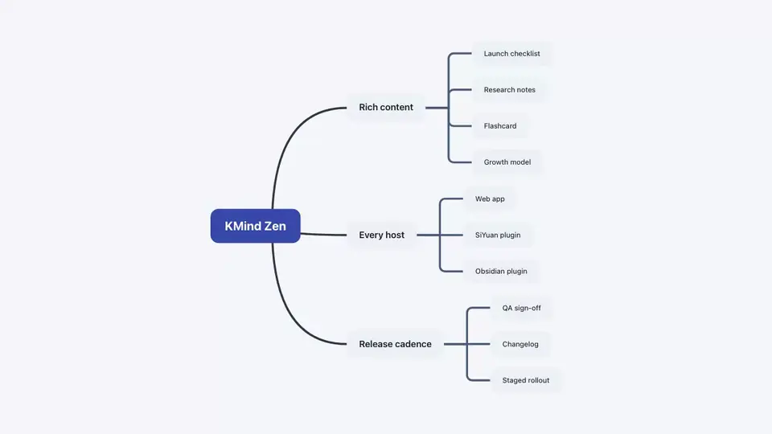
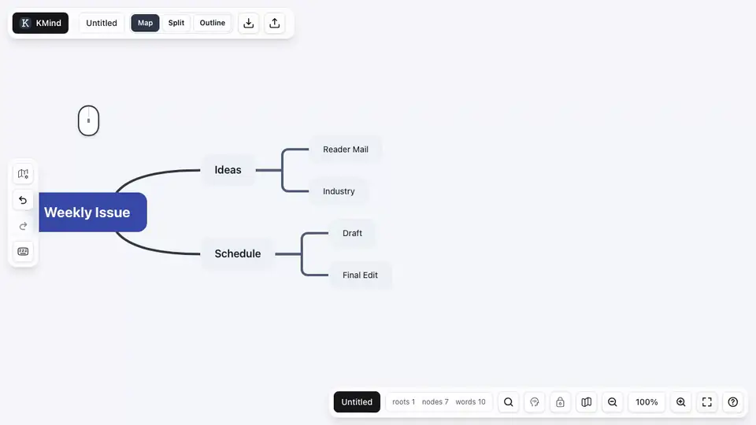
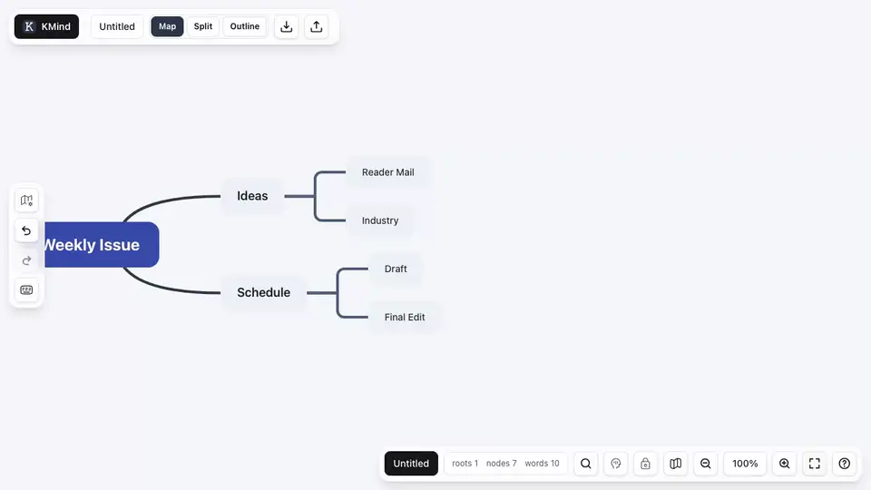
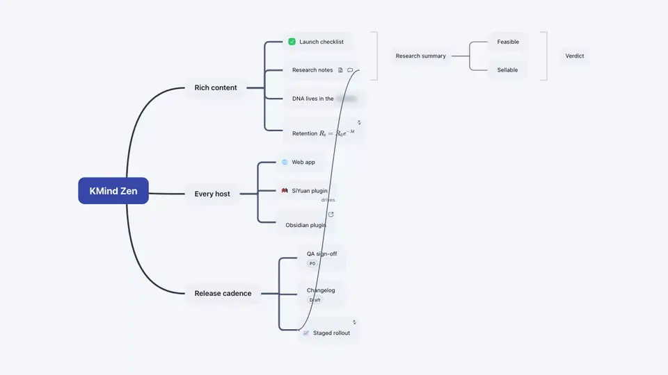
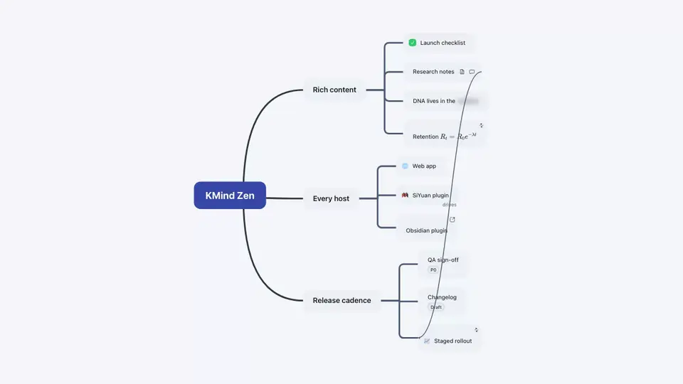
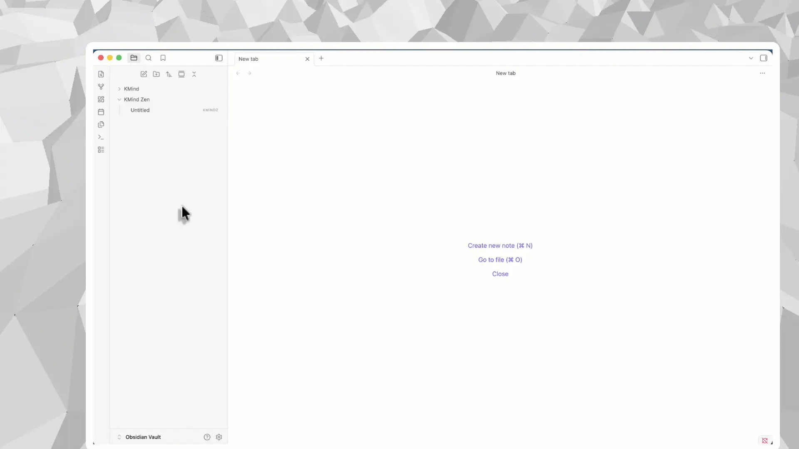
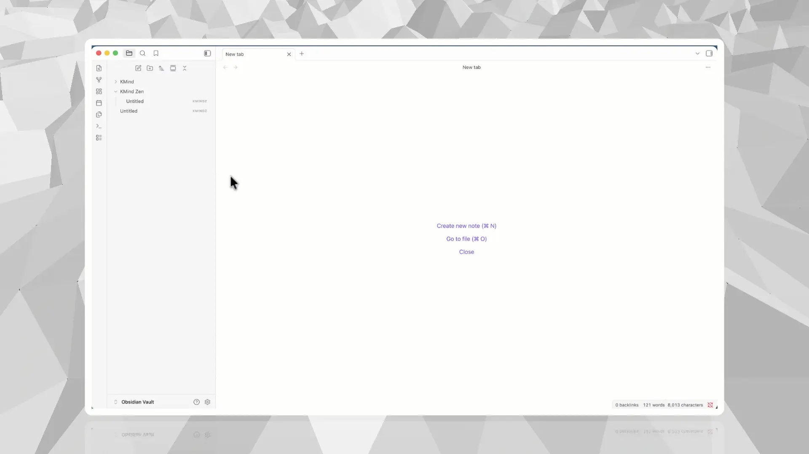
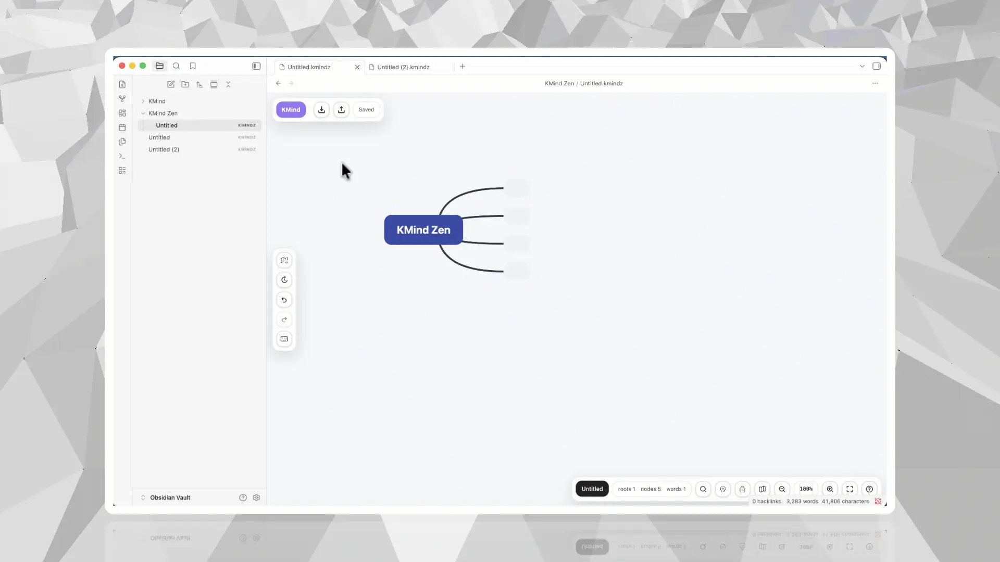
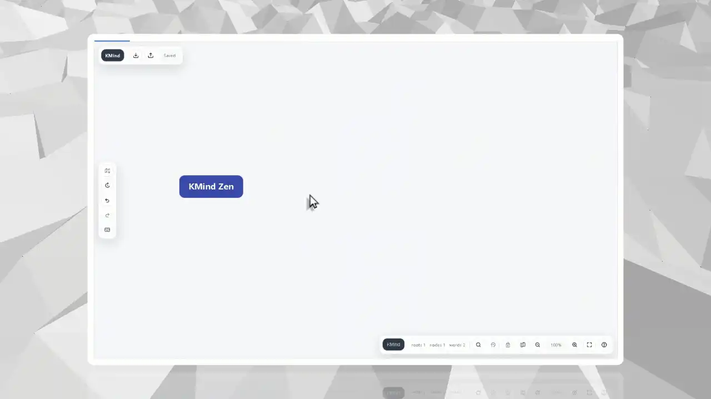

# KMind Zen for Obsidian

[中文说明](./README_zh_CN.md)

Local-first mind maps for your Obsidian vault.

KMind Zen lets you create, organize, reopen, and refine `.kmindz` mind maps as real files inside Obsidian. Your maps stay in your vault, so your existing folders, sync, backups, and version-control habits continue to work.

**Version:** `0.34.0` · [Changelog](https://kmind.app/en/changelog/obsidian) · [GitHub releases](https://github.com/suka233/obsidian-kmind-zen/releases)

## Why KMind Zen for Obsidian

- **Local-first `.kmindz` files**: maps are saved in your vault instead of hidden inside an external cloud workspace.
- **Vault-native creation**: start from the command palette, or create a map exactly where it belongs from the file tree menu.
- **Reopen from the file tree**: click any `.kmindz` file later and continue editing the same local file.
- **Focused editing with Zen mode**: reduce interface noise when a map becomes complex, while keeping save status, history, export, and zoom close.
- **One KMind Zen format across hosts**: move maps between Obsidian, SiYuan, the Web App, and the standalone desktop app.

## See It in Action

### One node, many kinds of content

To-dos, notes, comments, icons, tags, external and internal links, cloze deletions, LaTeX formulas, relationship lines, and summaries of summaries all live on the same map, and each of them is edited in place.

### Edit the same map as a canvas or an outline

Switch between Map, Split, and Outline views from the top bar. In Split view the canvas and the outline sit side by side and stay in sync.

Drag a canvas node onto an outline row to move it there, or drag an outline row back onto a canvas node to make it a child. Structure changes show up on both sides immediately.

### Themes that follow light and dark mode

Every official theme ships with a light and a dark variant, so the map follows Obsidian's appearance without a manual toggle. A local theme designer and `.kmind-theme.json` import/export take it further.

### Layouts for different kinds of thinking

Logic chart, two-sided mind map, timeline, and fishbone. Switch the layout of an existing map without rebuilding it.

Step-by-step tutorials with more clips: [Obsidian plugin tutorials](https://kmind.app/en/tutorials/obsidian-plugin-features) and the full [tutorial index](https://kmind.app/en/tutorials).

## Quick Start

### 1. Create your first map from the command palette

Run `KMind: New map` from the Obsidian command palette. The plugin creates a new `.kmindz` file and opens it directly in the KMind view.

### 2. Create a map exactly where it belongs

When you already know the project or topic folder for a map, right-click a folder or note in the Obsidian file tree and create a new KMind map there.

### 3. Reopen `.kmindz` files from your vault

After a map is created, it lives in the file tree like the rest of your vault files. Click it later to reopen the KMind view and keep editing the same local file.

### 4. Use Zen mode for complex structures

When a map grows, switch to Zen mode to quiet the interface and focus on structure. Frequent actions remain nearby when you need them.

## What Stays Local

- Mind maps remain local `.kmindz` files in your Obsidian vault.
- Autosave writes changes back to the same file.
- Your existing sync and backup setup can cover `.kmindz` files.
- License activation does not upload mind map document contents.
- The plugin reads and writes `.kmindz` maps and related asset or history files inside the current Obsidian vault.

## Features

- Rich-text mind map nodes and notes.
- Images, TODOs, icons, tags, comments, hyperlinks, format painter, and relationship lines.
- True in-place node editing that keeps the editor inside the node body.
- Outline and Split modes for editing the same map as a spatial canvas or a continuous outline.
- Split mode supports dragging nodes both ways between the map and outline.
- Relationship line routes: straight, orthogonal, rounded orthogonal, and brace, with a smoother editor that avoids blocking handles.
- Multiple links per node, with custom icons.
- Project-level layouts, themes, edge styles, rainbow edges, and background color settings.
- Smart light and dark theme variants.
- Local theme designer and `.kmind-theme.json` import/export.
- Reliable `.md` / `.opml` import and export, `.txt` import, `.mm` import/export, `.xmind` export, SVG / PNG export, and copy-as-image styles.
- Right-click expansion and collapse controls for quickly focusing large maps.
- Configurable canvas drag and wheel behavior: pan-first, select-first, direct wheel zoom, or `Ctrl/Cmd` wheel zoom.
- Keyboard shortcuts scoped to KMind Zen views.

## Installation

Recommended installation:

1. Open Obsidian Settings.
2. Go to Community plugins and search for `KMind Zen`.
3. Install and enable the plugin.

You can also use this repository with BRAT if you want to test a release before it reaches the marketplace update channel.

## Links

- Website: <https://kmind.app>
- Obsidian plugin page: <https://kmind.app/en/obsidian-plugin>
- Changelog: <https://kmind.app/en/changelog/obsidian>
- Tutorials: <https://kmind.app/en/tutorials>
- Quick start guide: <https://kmind.app/en/tutorials/obsidian-local-first-mind-maps>
- `.kmindz` file guide: <https://kmind.app/en/tutorials/obsidian-kmindz-files>

## Privacy, Local Files, and Network Access

- The plugin connects to `https://kmind.app` in this production build for licensing, trial activation, purchase sessions, pricing, and theme sharing.
- License requests may send licensing-related fields such as email address, license key, selected offer, coupon code, device public key, signed proof, lease, and refresh token.
- Theme sharing sends the selected `.kmind-theme.json` package, language, and optional shared content id to KMind services.
- Mind map files remain local `.kmindz` files in the Obsidian vault. The license flow does not upload mind map document contents.
- The plugin stores local license state in Obsidian browser storage, including a device keypair, signed lease, and refresh token.
- No dedicated telemetry or analytics pipeline is bundled.

## Release Metadata

- Source commit: `f5b2ee976dc44effdbeafa1fb35b27152a89ea50`
- Plugin version: `0.34.0`
- Minimum Obsidian version: `1.6.0`
