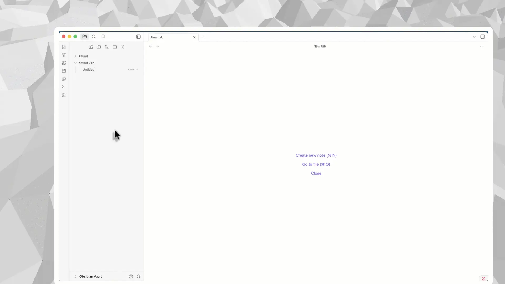
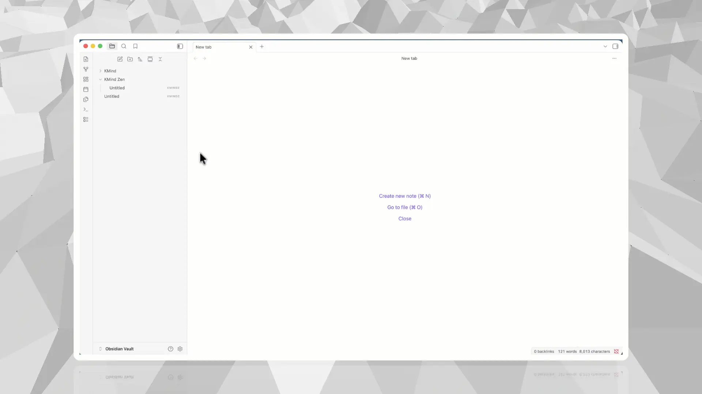
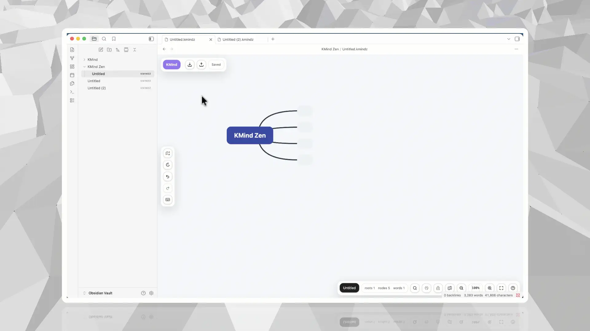
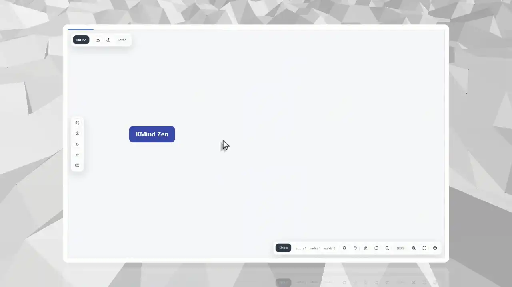

# KMind Zen Obsidian 插件

[English](./README.md)

面向 Obsidian Vault 的本地优先思维导图。

KMind Zen 会把导图作为 Vault 里的 `.kmindz` 本地文件来使用。你可以从命令面板或文件树创建导图，从 Vault 中重新打开它，并继续沿用已有的目录、同步、备份和版本管理习惯。

## 0.30.0 更新（2026-09-11）

### 新增

- 支持公式快捷输入：在节点正文和备注中输入或粘贴 $...$ 转换为行内公式，独占段落的 $$...$$ 转换为块公式
- 历史版本面板底部新增“抢救导图”功能，用于当遭遇可能的磁盘问题，同步问题和其它情况的时候,可以尽可能的导出备份的导图(提示，数据无价，请大家多多备份自己的本地知识库)

### 修复

- 修复拖拽调整关联线时，线条未实时更新预览的问题。
- 修复富文本颜色选择器在取消、切换或关闭时可能出现的选区丢失与交互异常。

### 优化

- 优化文字颜色和背景色选择，提供紧凑预设色板，支持清除颜色和选择更多颜色。
- 完善富文本工具栏、节点正文和备注编辑相关的中英文提示。

## 为什么选择 KMind Zen for Obsidian

- **本地优先 `.kmindz` 文件**：导图保存在你的 Vault 中，而不是隐藏在外部云端工作区。
- **符合 Vault 组织方式**：可以从命令面板快速创建，也可以从文件树菜单把导图创建到指定位置。
- **从文件树重新打开**：后续点击任意 `.kmindz` 文件，即可回到 KMind 视图继续编辑同一个本地文件。
- **禅模式专注整理**：导图复杂时降低界面噪音，同时保留保存状态、历史、导出、缩放等高频能力。
- **同一 KMind Zen 格式跨宿主流转**：导图可以在 Obsidian、思源、Web App 和独立桌面端之间迁移。

## 快速上手

### 1. 从命令面板创建第一张导图

在 Obsidian 命令面板中运行 `KMind: New map`，插件会创建一个新的 `.kmindz` 文件，并直接用 KMind 视图打开。

### 2. 把导图创建在真正想放的位置

如果你已经知道这张导图属于哪个项目、主题或笔记集合，可以在 Obsidian 文件树中右键文件夹或笔记，并创建新的 KMind 导图。

### 3. 从 Vault 重新打开 `.kmindz` 文件

`.kmindz` 创建后会像其它 Vault 文件一样出现在文件树中。后续点击它即可重新进入 KMind 视图，继续编辑同一个本地文件。

### 4. 用禅模式整理复杂结构

当导图逐渐变复杂，可以切换到禅模式，让画布先回到更安静的状态，专注梳理节点关系。

## 哪些内容保持本地

- 导图仍然是 Obsidian Vault 里的本地 `.kmindz` 文件。
- 自动保存会持续写回同一个文件。
- 你已有的同步和备份方案可以覆盖 `.kmindz` 文件。
- 授权激活不会上传导图文档内容。
- 插件会在当前 Obsidian Vault 内读写 `.kmindz` 导图及其相关资源或历史文件。

## 功能概览

- 富文本节点与富文本备注。
- 图片、TODO、图标、标签、批注、超链接、格式刷和关联线。
- 支持真正的节点内原地编辑，编辑区保持在节点正文内部。
- 大纲与分屏模式，可用空间画布或连续大纲编辑同一份导图。
- 分屏模式支持导图节点与大纲双向拖拽。
- 关联线支持直线、正交连线、圆角正交连线和大括号，并优化编辑器智能避让。
- 单个节点支持多个超链接，并可配置链接图标。
- 项目级布局、主题、连线样式、彩虹连线和背景色设置。
- 支持明亮 / 暗黑模式的智能主题。
- 本地主题设计器与 `.kmind-theme.json` 导入 / 导出。
- 更稳定的 `.md` / `.opml` 导入导出、`.txt` 导入、`.mm` 导入导出、`.xmind` 导出、SVG / PNG 导出和复制为图片样式。
- 右键菜单支持按层级展开和快速展开 / 收起，便于聚焦大型导图。
- 可配置画布拖拽习惯与滚轮行为：平移优先、选择优先、直接缩放或按 `Ctrl/Cmd` 滚轮缩放。
- 只在 KMind Zen 视图中生效的快捷键。

## 安装

推荐安装方式：

1. 打开 Obsidian 设置。
2. 进入社区插件并搜索 `KMind Zen`。
3. 安装并启用插件。

如果你想在社区插件市场更新前测试某个发布版本，也可以通过 BRAT 使用本仓库安装。

## 相关链接

- 官网：<https://kmind.app>
- Obsidian 插件介绍页：<https://kmind.app/en/obsidian-plugin>
- 快速上手指南：<https://kmind.app/en/tutorials/obsidian-local-first-mind-maps>
- `.kmindz` 文件管理指南：<https://kmind.app/en/tutorials/obsidian-kmindz-files>

## 隐私、本地文件与网络访问

- 当前正式构建会连接 `https://kmind.app`，用于授权、试用、购买会话、价格和主题分享。
- 授权请求可能发送邮箱、授权码、所选套餐、优惠码、设备公钥、签名证明、lease 与 refresh token 等授权相关字段。
- 主题分享会发送选中的 `.kmind-theme.json` 主题包、语言和可选 shared content id。
- 导图文件仍以本地 `.kmindz` 文件形式保存在 Obsidian Vault 中，授权流程不会上传导图文档内容。
- 插件会在 Obsidian 本地浏览器存储中保存本地授权状态，包括设备密钥对、签名 lease 和 refresh token。
- 未内置独立的遥测或统计上报管线。

## 审核说明：源码边界

本仓库是为 Obsidian 市场审核生成的公开源码快照，包含 KMind Zen 的 Obsidian 宿主适配层源码、插件 manifest、样式、快速上手资源与发布元数据。

Obsidian 适配层源码位于 `src/`。KMind Zen 共享内核包（例如 `@kmind/core`、`@kmind/app`、`@kmind/editor-react`、`@kmind/app-react`、`@kmind/icons`、`@kmind/i18n`）仍为闭源专有代码，不包含在该公开快照中。

可安装产物由 KMind 私有构建流水线生成，并通过 GitHub Releases 上传 `main.js`、`manifest.json` 和 `styles.css`。

## 发布元数据

- 源码提交：`c387ae37265fd1189d02c02cff78a0d6d04451b2`
- 插件版本：`0.32.0`
- 最低 Obsidian 版本：`1.6.0`
